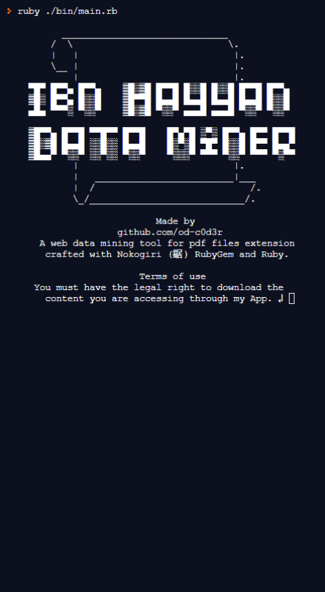

Hit That ⭐️ if you like it !  

# 💎Ruby Capstone Project  ⚒ Ibn Hayyan Data Miner

 _A web data mining tool for seaching and extracting pdf files from [PDFdrive.com](www.pdfdrive.com)  Crafted with [Nokogiri](https://nokogiri.org/) (鋸) RubyGem and Ruby._

## 📺 Live Demo 

- [Ibn-Hayyan Data Miner](https://repl.it/@OmarRashad/Ibn-Hayyan-Data-Miner)

## 📡 Technologies used :

- Ruby 
- RSpec -  _Ruby Test Driven Development framework_

## 🔧 Tools used :

1. [Trello](http://trello.com) -  _Task and time managment_
1. [VSCode](https://code.visualstudio.com/) - _As a code editor_
1. [Nokogiri](https://nokogiri.org/) - _Ruby gem as a Main tool_
1. [Rubocop](https://rubocop.org/) - _Ruby gem as a Ruby Linter_
1. [Google DevTools](https://developers.google.com/) - _Debugging tool_

## How to use it
Open the Live code link or follow `Development` section for acquiring a local copy of the App, made for you.

1. Once you are in the repository folder run `ruby ./bin/main.rb`
1. Read the `Terms of use` then hit `Enter↲`
1. After `Search for : ` type your query.
1. Top 20 results for your query will appear.
1. Enter the file index to open in system default browser or type `search` for new query.
1. Type `exit` if you wanted to. 

## Development

Follow these steps to get a local copy up and running :

1. Install [`git`](https://git-scm.com/) on your local machine.
1. On terminal Type `git clone https://github.com/od-c0d3r/Ibn-Hayyan-Data-Miner`
1. On terminal Type `cd Ibn-Hayyan-Data-Miner`
1. Make sure you have [Ruby](https://www.ruby-lang.org/en/) Run-time installed.
1. You can escape steps `6` and `7` by typing `bundle install`
1. Install [`Nokogiri`](https://nokogiri.org/) gem by `gem intsall nokogiri` 
1. Install [`RSpec`](https://rspec.info/) gem by `gem install rspec` 
1. Finialy Run `ruby ./bin/main.rb` 

For testing :
- Run RSpec tests in terminal with `rspec` in the repository root.

## Show your support 🤙

- Give a ⭐️ if you like this project! OR 
Even better, contribute in [issues](./issures) by suggest an improvment or locate a 🐞! 
And give it a try by submiting a [pull requst](./pulls) so we can discuss the changes ! 

## Acknowledgments 📜

- Display result file link to user. _Suggestion by [@iam-Akshat](https://www.github.com/iam-Akshat)_
- Website used in the miner [Pdfdrive.com](www.pdfdrive.com)

## Auther `Omar R.`

- 
- 

## License 📝

This project is [MIT](https://opensource.org/licenses/MIT) licensed.
